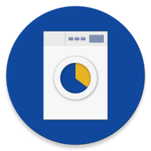

# NagymosáSCH

Mosógép program lejárati idő nyilvántartó app a Schönherz Kollégium lakói számára

## Használat

_Probléma_: Az összes mosógép foglalt a kollégiumban, és tudni szeretnéd, hogy melyik jár le a leghamarabb.

_Megoldás_: Végigjárod az összes szintet és beírod az appba, hogy ott mennyi idő van még a programból. Az app megjegyzi, és idő szerint növekvő sorrendbe állítva megmutatja ezeket.
